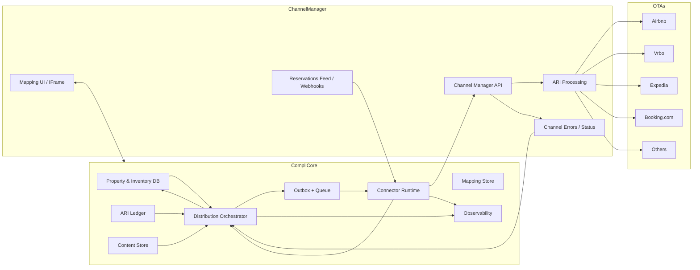

# Channel Distribution Roadmap for CompliCore

## Executive Summary

CompliCore can only claim "unlimited channels" when three foundations are in place:

1. A canonical property + ARI model
2. Deterministic reservation ingestion
3. An entitlement-grade synchronization orchestration layer

Operationally, success is defined as: **no double bookings, no stale rates, no silent failures, and no manual cleanup**.

The fastest implementation path is to use a **Channel Manager API as the distribution spine** (connect once, map once, distribute many), while treating direct OTA integrations as a separate long-term certification and compliance program.

---

## Strategy: Channel Manager First, Direct OTA Second

### Why a channel manager is the MVP path

A channel manager integration gives CompliCore:

- Unified ARI push surface (availability, rates, restrictions)
- Normalized reservation ingestion with acknowledgement semantics
- Existing OTA mappings and onboarding relationships
- Faster channel expansion without per-OTA protocol rebuilds

### Why direct OTA integrations are a separate lane

Direct integrations are partner-gated and require onboarding, certification, and compliance maintenance (e.g., PCI/PII controls, API lifecycle updates). These should be handled as an enterprise program with dedicated partner/alliance ownership, not an MVP milestone.

### iCal is fallback-only

iCal should be explicitly excluded from "Zero Operational Friction" claims due to delayed synchronization and limited data scope (availability-centric, weak reservation fidelity, no robust ARI parity).

---

## Target Architecture

---

## Canonical Data Model (Distribution Scope)

- **Property**: address, geo, currency, policy primitives
- **Unit inventory**: room types and counts (including rental-style room-type compatibility)
- **Rate plans**: BAR/NRF/refundable, LOS patterns
- **ARI ledger (daily)**:
  - Allocation
  - Restrictions (CTA/CTD/min-max LOS)
  - Price
- **Content**: photos, facilities, policies, descriptions
- **Mapping**: internal IDs ↔ channel-manager and OTA IDs
- **Reservation revisions**: source, external identifiers, revision sequence, payment metadata

---

## Phased Delivery Plan

## Phase A — Foundations

### Deliverables
- Canonical distribution schema + ERD
- Connector adapter contract (ARI/content/reservations/errors)
- Mapping store lifecycle (`created → validated → active → drifted`)
- Embedded channel mapping UX (provider iframe/token flow)
- Distribution event taxonomy and audit logs

### Acceptance Criteria
- Mapping can only become **Active** when required room/rate mappings are complete
- Embedded mapping flow loads and supports channel filtering

### Targets
- Time to connect provider (p50): <15 min
- Mapping completeness: 100% before publish activation

---

## Phase B — ARI Push

### Deliverables
- ARI delta generator from ledger events
- Batch policy with per-property ordering
- Idempotent retry model and dedupe keys
- ARI operational APIs (`recompute`, `push`, sync status)
- Drift detection triggers

### Reliability Rules
- Serialize ARI per property
- Batch updates to reduce provider queue depth and latency
- Enforce convergence semantics on retries

### Targets
- Reservation-to-ARI completion p95: <60s
- ARI push success: ≥99.5%
- Overbooking caused by sync: 0

---

## Phase C — Reservations Ingestion

### Deliverables
- Reservation revision ingestion pipeline (feed/webhook)
- Acknowledge-after-commit behavior
- Atomic apply flow: store reservation → update ledger → emit outbox
- Modification/cancellation reversal rules
- Replay-safe idempotency

### Acceptance Criteria
- New/modify/cancel revisions apply exactly once
- Unacknowledged revisions do not accumulate

### Targets
- Reservation ingest to commit p95: <15s
- Duplicate apply rate: 0

---

## Phase D — Content Sync + Publish Lifecycle

### Deliverables
- Content objects: photos, policies, facilities/amenities
- Workflow states: `draft → validated → published`
- Channel SLA status and visibility in UI
- Channel-specific overrides where needed

### Acceptance Criteria
- Channel status view includes last push, last ack, next reconciliation
- Published content has deterministic state tracking by channel

---

## Phase E — Go-Live + Rollout Controls

### Deliverables
- OTA/provider readiness and certification matrix
- Sandbox certification scripts and pilot plan
- Progressive rollout with rollback triggers
- Reconciliation + drift correction jobs

### Acceptance Criteria
- 30-day pilot with:
  - 0 sync-caused overbookings
  - pipeline SLOs met
  - reconciliation actively correcting drift

---

## Reliability and Observability Standards

### Idempotency + Retry

- Reservation dedupe key: external reservation ID + revision/system identifier
- ARI dedupe key: `(property_id, room_type_id, rate_plan_id, date, value_type)` + sequence
- Internally prefer idempotent "set-state" semantics for retried pushes

### Dashboards

- ARI throughput, latency, error rate (by channel code)
- Reservation ingest lag and acknowledgement lag
- Drift detected vs corrected
- Queue backlog and retry depth

### Alerts

- Reservation ingest p95 breach
- ARI backlog threshold exceeded
- Property-level drift threshold exceeded

---

## Compliance and Commercial Controls

- **Partner gating**: direct OTA programs handled as dedicated compliance/certification lane
- **PCI/PII boundary**: least privilege, encryption, audit trails, retention controls
- **Merchant-of-record clarity**: distribution sync does not imply MoR obligations unless contractually selected
- **Product constraints**: encode channel-specific restrictions into onboarding and booking flows

---

## Consolidated Launch Checklist

- [ ] Channel manager API selected as primary distribution spine
- [ ] Canonical model shipped (property, room types, rate plans, ARI ledger, reservation revisions)
- [ ] Embedded mapping UX shipped with activation gating
- [ ] ARI push shipped with batching, ordering, and idempotency
- [ ] Reservation ingest shipped with durable ack-after-commit semantics
- [ ] Content sync shipped (photos, policies, facilities)
- [ ] Reconciliation and drift correction in production
- [ ] Observability dashboards + alerts live
- [ ] Compliance boundaries documented and audited
- [ ] iCal explicitly marked fallback-only
- [ ] Pilot SLOs achieved

---

## Success Metrics (North Star)

- **0** overbookings attributable to distribution sync
- **≥99.5%** ARI push success
- **p95 <15s** reservation ingest-to-commit
- **p95 <60s** reservation ingest-to-ARI-completion
- **0** silent failures (all error states actionable and surfaced)
